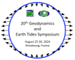

## Sub-Commission 3.1 Earth Tides and Geodynamics

  

### Online seminars

SC3.1 online seminars will start again in 2025 !

Those interested to share their work and give an online seminar, are kindly asked to contact **Severine Rosat** (severine.rosat@unistra.fr) or **Xiaoming Cui** (cxm@apm.ac.cn). This invitation includes PhD and Master students, as well as PostDocs and senior scientists.

### [List of 2023 online seminars](2023_seminars.md)

### [List of 2022 online seminars](2022_seminars.md)

### Geodynamics and Earth Tides Symposium 

The SC3.1 is responsible for the organization of the Geodynamics and Earth Tides Symposium which is held every 4 years. In 2024, the 20th Geodynamics and Earth Tides Symposium was held in Strasbourg (France) from 25th to 30th of August.

Thanks to all the speakers and attendees. The G-ETS2024 website is available [here](https://g-ets2024.sciencesconf.org/).

The list of all ETS and G-ETS symposia is [here](G-ETS.md).

During the 20th G-ETS, the **Paul Melchior's medal** was awarded to **Duncan C. Agnew** and **Jacques Hinderer**. Previous awardees are listed [here](MelchiorPrize.md).

The 2024 **G-ETS early-career scientist prize** was awarded to **Marvin Reich** (GFZ Potsdam, Germany). This was the first edition of this new prize. 

Congratulations to them!

### Topics of IAG SC3.1
The Topics that are relevant to the Earth Tides and Geodynamics Commission take into account geodynamic phenomena on different temporal and spatial scales. These geodynamic phenomena can be observed by modern instrumentation and monitoring systems, both terrestrial and space-borne. The seminars will be open for a wide range of scientific problems in geodynamics research. Interactions of geophysical fluids with Earth tides phenomena and observations are a specific focus and includes:

- Tidal and non-tidal loading in space geodetic and subsurface observations
- Permanent and dynamic effects of Earth tides on the geodetic reference system
- Using tides and ocean tidal loading with modern geodesy to probe Earth structure
- Variations in Earth rotation, gravity field and geocenter due to mass redistributions
- Tidal forcing of plate movement
- Subsurface fluid movement through geodetic and gravity observation
- Fluid pressure changes due to Earth tides
- Stress and deformation changes due to injected fluids
- Earth tides, mass movements and deformation at volcanoes
- Tidal effects on geodetic satellites as GOCE, GRACE, …
- Innovations in instrumentation for gravity and deformation observation
- Innovations in software, data analyses and prediction methods of loading and tides
- Induced seismicity
- Tides and geodynamics in planets
